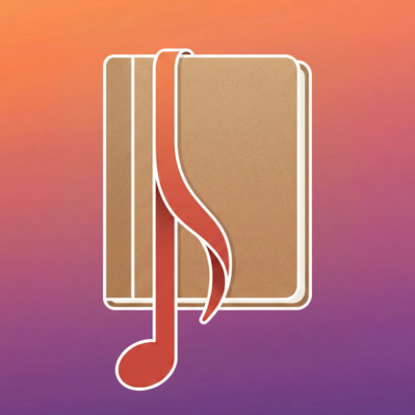
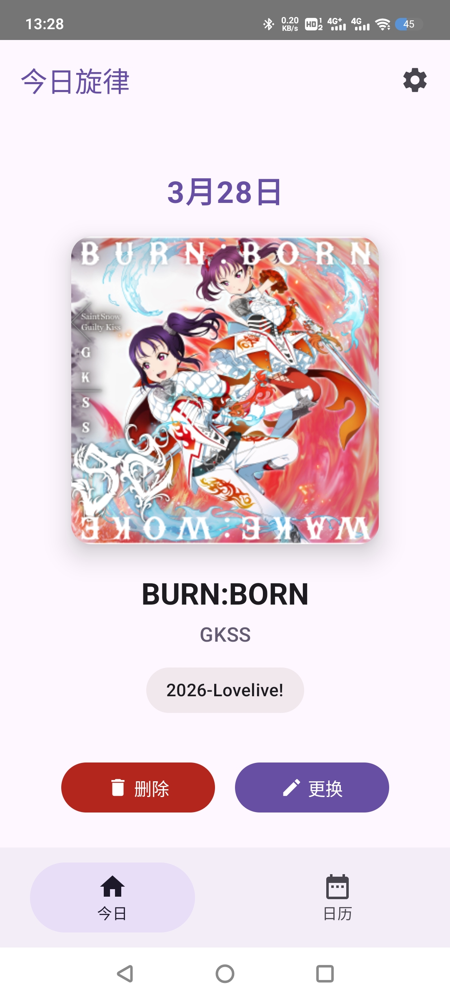
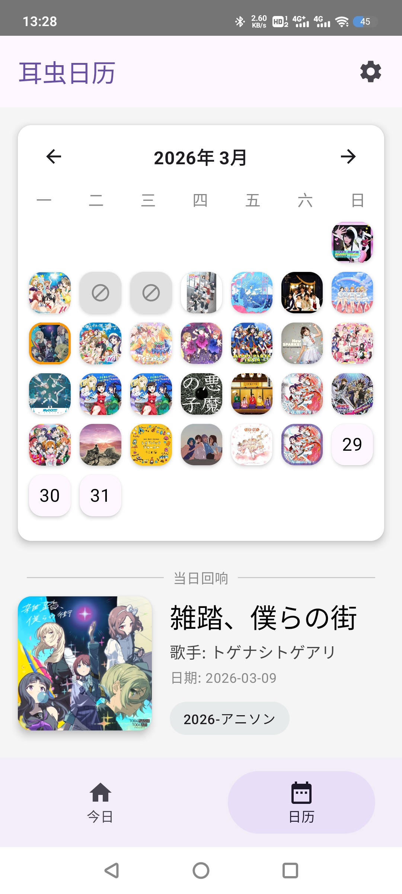
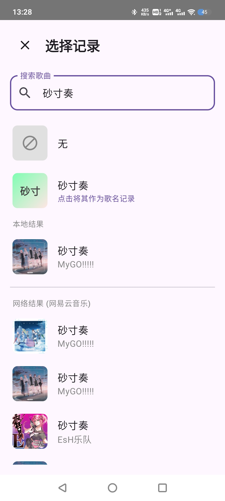

  
  <h1>🎵 耳虫日记 (Earworm Diary)</h1>
  
<b>捕捉每日清晨，脑海中盘旋的那段旋律。</b>

  

    
    
    
    
  

## 📖 简介

你是否也有过这样的时刻：清晨醒来，脑海中莫名循环着一段旋律？或是行色匆匆时，突然被某首歌“击中”心绪？

**耳虫日记** 是一款专注于记录“耳虫现象”（Earworm）的 Android 应用程序。它不仅是一个记录工具，更是一本由旋律与专辑封面编织而成的**听觉手账**。旨在帮你捕捉那些稍纵即逝的听觉记忆。

---

<!-- ## 📱 界面与功能预览

 -->

## 📱 界面与功能预览

<table align="center">
  <tr>
    <td align="center" width="33%">
      
    </td>
    <td align="center" width="33%">
      
    </td>
    <td align="center" width="33%">
      
    </td>
  </tr>
  <tr>
    <td align="center">
      <b>🎵 捕捉清晨灵感</b> 
      极简的今日面板，支持纯文本记录或本地高音质音频解析，快速留住那段耳虫。
    </td>
    <td align="center">
      <b>📅 专属音乐画卷</b> 
      告别枯燥列表，用专辑封面重塑月度日历，让每一天的情绪记忆都清晰可见。
    </td>
    <td align="center">
      <b>🔍 智能云端检索</b> 
      本地库未命中？内置 API 智能兜底，一键全网搜索并精准补全封面与曲目信息。
    </td>
  </tr>
</table>

---

## ✨ 核心特性

### 📅 沉浸式音乐日历
告别枯燥的列表，用**专辑封面墙**拼凑你的月度音乐心情。
* **月视图画卷**：以封面图填充日历，直观呈现每日“耳虫”。
* **时光回溯**：点击日期查看详细记录，支持年份/月份快速跳转。
* **多维分类**：支持自定义标签与分类管理，让你的音乐偏好有迹可循。

### ⚡ 高效交互与智能记录
为捕捉灵感而生的流畅体验，让记录不再繁琐。
* **混合检索模式**：极速扫描本地高音质音频，联网搜索网易云音乐 API 兜底，或直接使用纯文本记录。
* **智能关联修复**：自动将过往的“纯文本/网络记录”匹配至本地新下载的高音质文件，实现数据“无感升级”。
* **手势复刻**：独创**长按拖拽**交互，只需轻轻一拖，即可将昨天的旋律“延续”到今天。

### 🛡️ 离线优先与绝对隐私
你的记忆只属于你自己。
* **数据主权**：所有日记数据完全存储于本地，无云端上传，无追踪代码。
* **便捷迁移**：支持标准 JSON 格式的导入与导出，备份随心。

---

## 🛠️ 技术栈 (Tech Stack)

本项目完全使用现代 Android 开发技术栈构建：
* **语言**: [Kotlin](https://kotlinlang.org/) (100%)
* **UI 框架**: [Jetpack Compose](https://developer.android.com/jetpack/compose) + Material Design 3
* **图像加载**: [Coil](https://coil-kt.github.io/coil/) (支持交叉淡入、本地音频嵌入封面解析)
* **数据持久化**: [Room](https://developer.android.com/training/data-storage/room)
* **导航**: Jetpack Navigation Compose

---

## 🚀 快速开始 (Quick Start)

请前往 [Releases 页面](链接到你的Releases) 下载最新版本的 APK 文件进行安装。