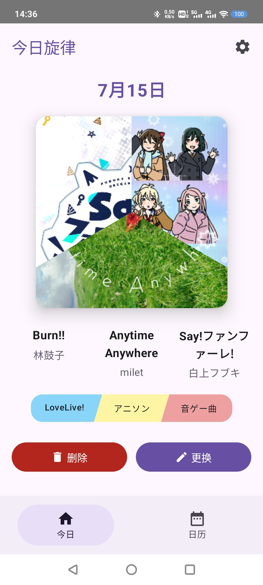
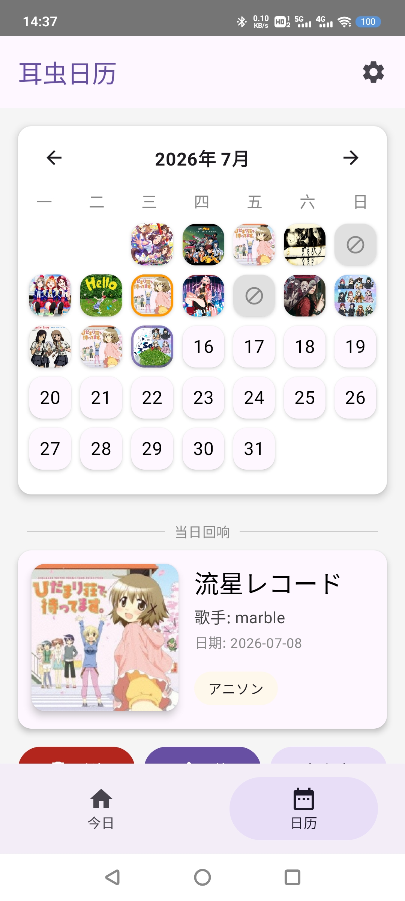
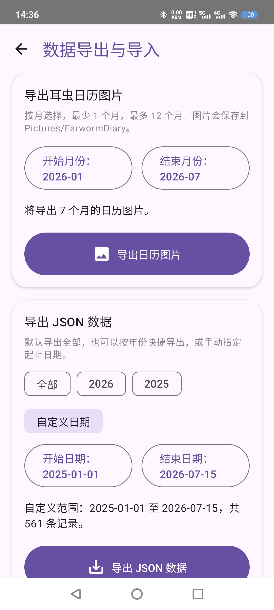
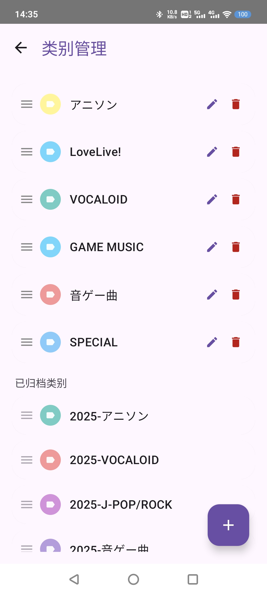
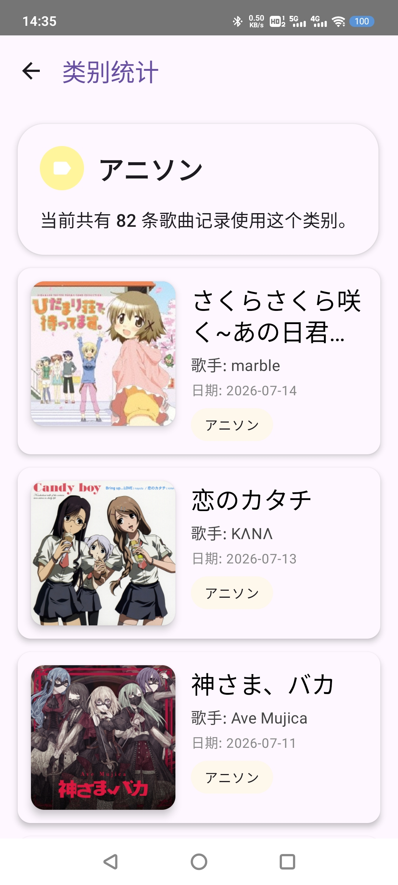

  
  <h1>🎵 耳虫日记 (Earworm Diary)</h1>
  
<b>捕捉每日清晨，脑海中盘旋的那段旋律。</b>

  

    
    
    
    
  

## 📖 简介

你是否也有过这样的时刻：清晨醒来，脑海中莫名循环着一段旋律；或是在某个普通的瞬间，突然被一首歌击中？

**耳虫日记** 是一款专注于记录“耳虫现象”（Earworm）的 Android 应用。它把每天浮现在脑海里的旋律整理成可回看、可分类、可导出的音乐日历，让零散的听觉记忆沉淀为长期可追踪的个人记录。

---

## 📱 界面与功能预览

<table align="center">
  <tr>
    <td align="center" width="33%">
      
    </td>
    <td align="center" width="33%">
      
    </td>
    <td align="center" width="33%">
      
    </td>
  </tr>
  <tr>
    <td align="center">
      <b>🎵 今日记录</b> 
      支持单日记录 1 到 3 首歌，并为每首歌分别设置类别，适合记录同一天的多重耳虫。
    </td>
    <td align="center">
      <b>📅 耳虫日历</b> 
      用专辑封面重建月历视图，按日期回看当日记录与分类信息。
    </td>
    <td align="center">
      <b>🔍 混合搜索</b> 
      本地媒体库优先，未命中时再使用网易云音乐搜索兜底。
    </td>
  </tr>
  <tr>
    <td align="center" width="33%">
      
    </td>
    <td align="center" width="33%">
      
    </td>
    <td align="center" width="33%">
      
    </td>
  </tr>
  <tr>
    <td align="center">
      <b>📤 区间导出</b> 
      支持按月份导出耳虫日历图片，也支持按年份或自定义起止日期导出 JSON 数据。
    </td>
    <td align="center">
      <b>🗂️ 类别管理</b> 
      可维护活跃类别与已归档类别，支持排序、编辑、删除和长期整理。
    </td>
    <td align="center">
      <b>📊 类别统计</b> 
      从类别直接查看命中条数和历史歌曲记录，快速回看某一类音乐偏好。
    </td>
  </tr>
</table>

---

## ✨ 核心特性

### 🎼 单日可记录 1 到 3 首歌

- 支持一天内记录 1 首、2 首或 3 首歌，适合“同一天脑内循环多首歌”的情况。
- 已有记录可继续追加歌曲，也可以按单首进行更换、删除或整体替换。
- 每首歌都可以独立设置类别，便于后续统计和归档。

### 🔍 本地优先的混合检索

- 优先扫描本地音频文件并解析封面、标题、歌手等信息。
- 当本地库未命中时，可继续使用网易云音乐搜索补全记录。
- 支持纯文本记录、网络记录与本地文件记录共存。
- 新下载到本地的歌曲可自动关联已有文本/网络记录，减少重复整理成本。

### 📅 可视化耳虫日历

- 使用专辑封面填充月历单元格，直观看到整个月的“耳虫分布”。
- 支持按年/月快速跳转，并点击具体日期查看详细记录。
- 当天若记录多首歌，会在视觉上进行拆分展示，而不是压缩成单条文本。

### 🗂️ 类别管理、归档与统计

- 支持自定义类别，并为每条歌曲记录单独打标签。
- 类别可排序、编辑、删除，也支持归档不再继续使用的类别。
- 归档后的类别不会破坏历史数据，仍可继续查看该类别下的全部歌曲记录。
- 可从类别页进入统计视图，查看某个类别累计命中的歌曲条目。

### 📤 数据导入导出

- 支持导出 JSON 数据，默认可导出全部记录。
- 支持按年份快捷导出，也支持手动指定起止日期导出。
- 导出的 JSON 会保留多首歌曲记录与类别信息，便于备份与迁移。
- 支持从 JSON 导入数据；相同日期的记录会被覆盖，本地找不到歌曲时会自动降级为纯文字记录。

### 🖼️ 耳虫日历图片导出

- 支持按月份范围导出耳虫日历图片。
- 最少可导出 1 个月，最多可连续导出 12 个月。
- 导出图片会保存到 `Pictures/EarwormDiary`，适合做长期存档或分享。

### 🛡️ 离线优先与本地存储

- 应用数据默认保存在本地，无需依赖云端服务。
- 分类与日记记录都以本地文件形式保存，便于用户掌控和备份。
- 无账号系统、无同步前提，更适合作为私人音乐日志使用。

---

## 🛠️ 技术栈

- **语言**: [Kotlin](https://kotlinlang.org/)
- **UI**: [Jetpack Compose](https://developer.android.com/jetpack/compose) + Material 3
- **导航**: Navigation Compose
- **图片加载**: [Coil](https://coil-kt.github.io/coil/)
- **文件导出/导入**: Android `DocumentFile` / SAF
- **数据持久化**: 本地 JSON 文件存储
- **音乐搜索补全**: 网易云音乐 API

---

## 🚀 快速开始

前往 [Releases](https://github.com/WatanabeChika/EarwormDiary/releases) 页面下载最新 APK 并安装。
